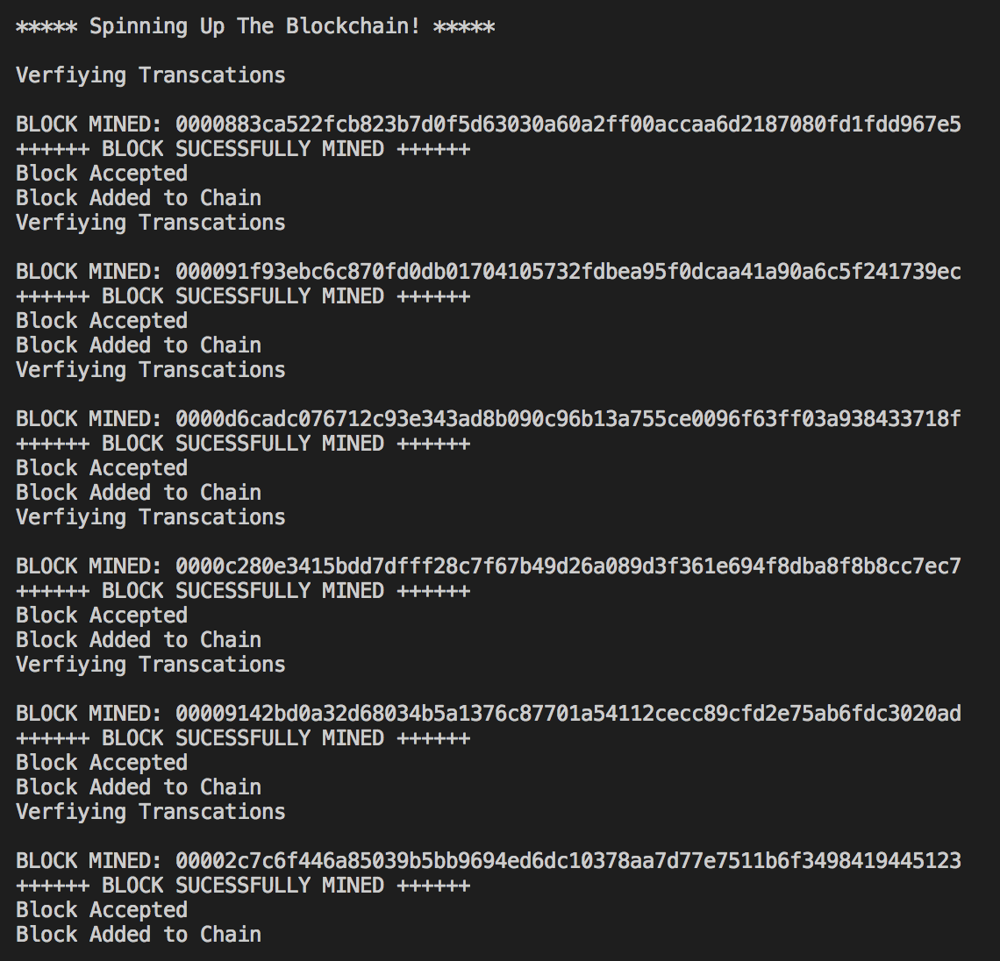
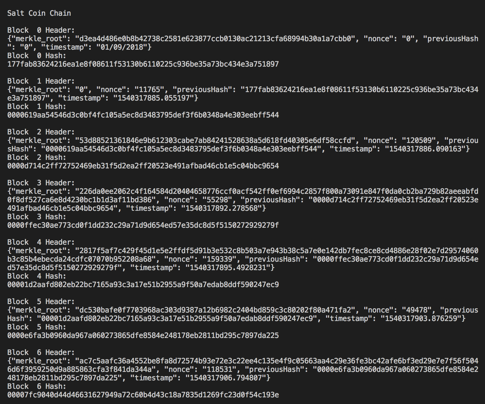
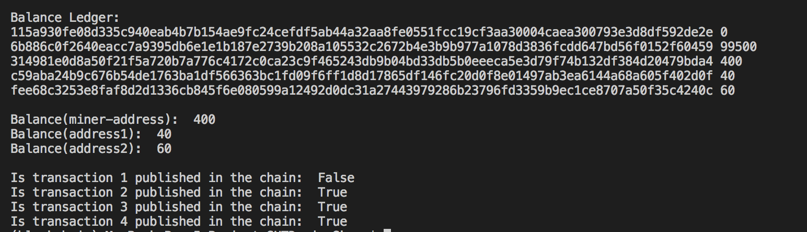
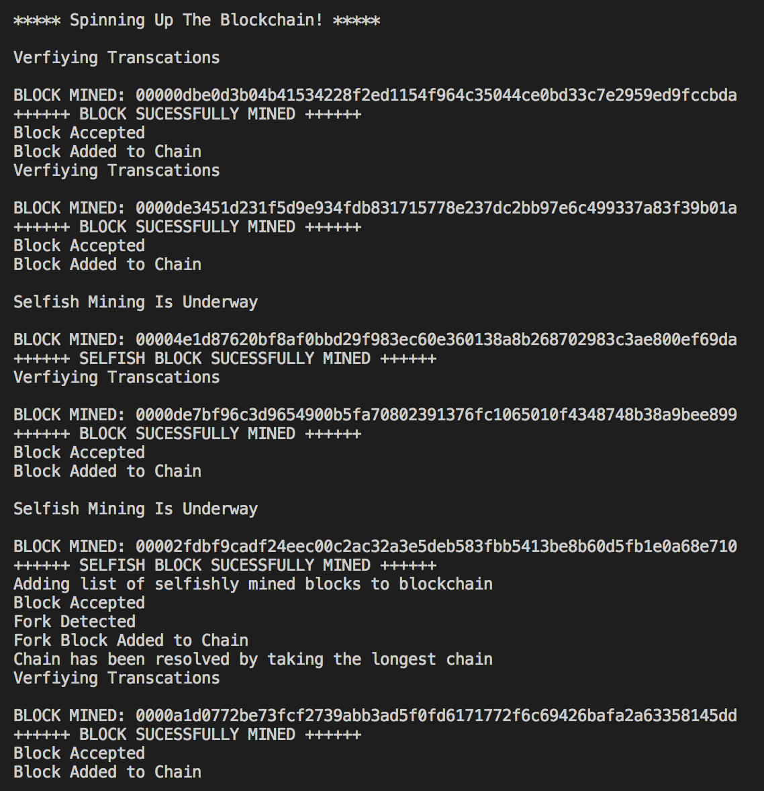
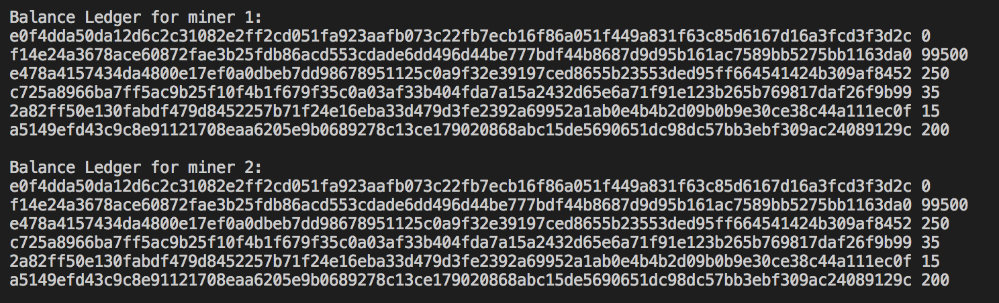

# BLOCKCHAIN PROJECT
Basic implementation of Blockchain

## Getting Started
1. Download git repo
2. In CLI, run main.py file, this implements all the blockchain functions
```
$ python main.py
```
You should get this result:






3.In CLI, run main_attack.py file, this implements the selfish mining attacks
```
$ python main_attack.py
```
You should get this result:




## Class Functions:
Transaction class:
  - validate: Returns True/ False to whether the transaction is valid (signed by sender)
  - sign: Signs the json message
  - to_json: Converts to a json message

Block class:
  - mineBlock: Proof of Work
  - calculateHash: Calculate a block's hash  
  - proof_tree: Returns a merkle path for a specified transaction, for proving in SPVclient
  - build_tree: Builds merkle tree from transactions.

Blockchain class:
  - createGenesisBlock: Creates a Genesis block
  - getLatestBlock: Gets the most recent block from the blockchain
  - checkvalidblock: Check the hash of the most recent block in chain is the same as the mined block's previous hash. Based on fork status the block will be added to create a fork in the chain
  - add: Checks if there is a fork in the chain and resolves it. After validation, it adds the block into the chain and rewards the miner
  - resolve: When there is a fork, resolve is called to resolve the chain by selecting the longest chain.


Miner class:
  - mine: Function to mine which mines the block and and updates the ledger and pushes changed to the chain
  - selfish_mine: Function to selfish mine which mines the block while not broadcasting the changes to the chain and only broadcasting the changes after mining a block first
  - update: Update function is suppose to simulate a broadcast function in a network. As they was no network we simulated the network broadcast functionality by calling it after a successful block mine.
  - send_transaction: Miners should have the ability to send money to other miners or clients
  - verifyTransaction: Verify Pending Transactions and add into list of verifiedTransactions
  - updateLedger: Updates address-balance ledger after sucessfuly mining block    
  - getChainLedger: When a new miner is added or a resolve happens on the chain. It calculates the record ledger of the chain and check record ledger dictionary if key of sender & receiver public key exist
  - chainvalidation: Validation of Chain's Hash, Checks every time we mine a block
  - getpath: Returns a merkle path for a specified transaction


SPV class:
  - get_block_header: Return all block headers from chain
  - receive_transaction: Proof Transacation exist in block
  - send_transaction: Sends a signed transaction


## Differences between Bitcoin and your SUTDcoin:
In Bitcoin, everything is decentralised.

But for our implementation of SUTDcoin, due to constraints of network, we were not able to make it decentralised.

e.g. Our pool of transactions is a centralised pool.

## Authors
Charles Wong

Law Jia Li

Aravind Kandiah
